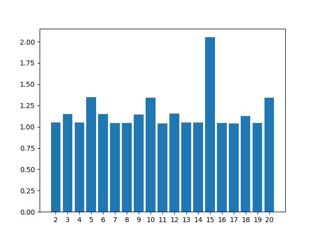
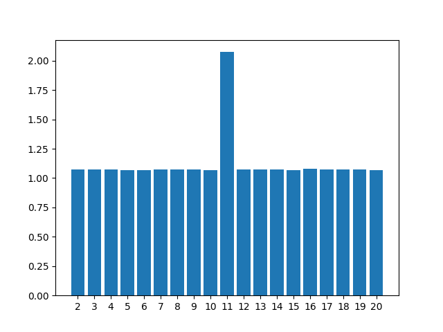
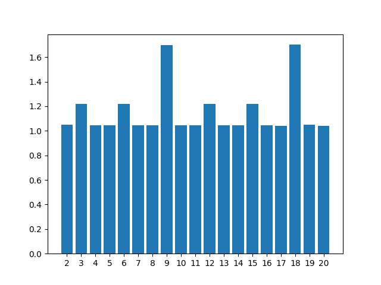
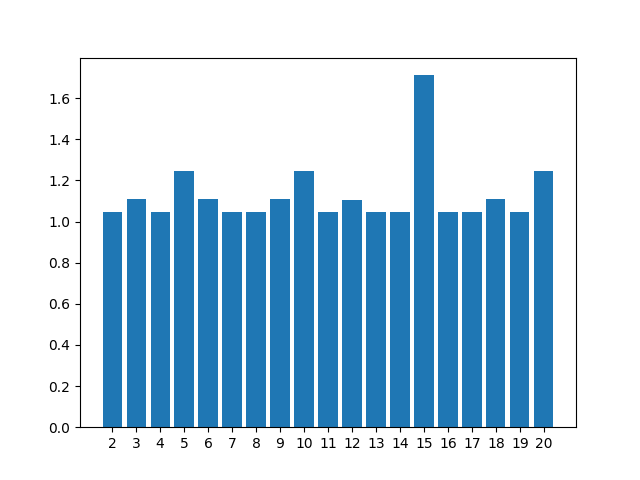
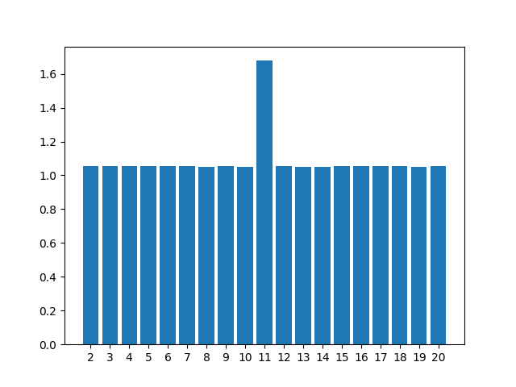

# Breaking-vigenere-ciphers
An example of classical cryptography and how to break polyalphabetic ciphers such as Vigenère's cipher


## What is the vigenère cipher

Wikipedia defines it has: ***a method of encrypting alphabetic text where each letter of the plaintext is encoded with a different Caesar cipher, whose increment is determined by the corresponding letter of another text, the key.***

### But what is a Caesar cipher:
A monoalphabetic shift cipher. One of the simplest modes of encrytpion. It's an encryption where we swap each letter in a text of a given alphabet in to another. This swap is given by an integer of the displacment of shifth that needs to be done.

For example if we have the alphabet:
* ABCDEFGHIJKLMNOPQRSTUVWXYZ

A shift with a key 3 (can also be represented as 3) will give us the corresponding alphabet 

* XYZABCDEFGHIJKLMNOPQRSTUVW

In this case any text encrypted with 3 the letter A will correspond to X, B will correspond to Y, ... ( and so on )

|With a key of 3||
|--|--|
|PlainText|THE QUICK BROWN FOX JUMPS OVER THE LAZY DOG|
|CipherText|QEB NRFZH YOLTK CLU GRJMP LSBO QEB IXWV ALD|

This cipher is a **monoalphabetic substitution**.

To decrypt we perform the operation in the oposite way

### Vigenère cipher

The vigenère cipher is base on the Caesar cipher but instead of being a monoalphabetic substitution, it's a **polyalphabetic substitution**. The key to decrypting and encryption is not one single number of letter evaluating a shift, but combination of numbers representing shifts.

For example:

* Given a text such as ***thequickbrownfoxjumpsoverthelazydog*** and a key like ***lmao*** we can encrypt this as such

    Shifts are preform with the key in a round robin way because the key is shorter than the plaintext

    | T | H | E | Q | U | (...) |
    |---|---|---|---|---|---|
    |shift with L|shift with M|shift with A| shift with O| shift with L|(...)|
    |E|T|E|E|F|(...)|

* The result will be ***eteefucymdokyrolugmddavscfhswmzmoag***

## Before encryption

Before encrypting a plain text with a key its important to clean and standardize them to use the same alphabet.
Example: 

```
Yes, I'm officially on vacation. I will be on vacation for five glorious days because I am clever. I am smart and have actually managed to schedule several of these 4-5 day vacations through the rest of the year.

I have two days off during the week because working the weekends if fucking ridiculously easy and I can't believe more people don't want to do it. But that's okay, we won't say shit to them about how wonderful it is. We'll continue to tell them how horrid it is, "Oh yah, working the weekend while everyone else is off and out and about doing their thing...man it totally sucks!"
```

Should be cleaned to be represented like this: 

```
YESIMOFFICIALLYONVACATIONIWILLBEONVACATIONFORFIVEGLORIOUSDAYSBECAUSEIAMCLEVERIAMSMARTANDHAVEACTUALLYMANAGEDTOSCHEDULESEVERALOFTHESEDAYVACATIONSTHROUGHTHERESTOFTHEYEARIHAVETWODAYSOFFDURINGTHEWEEKBECAUSEWORKINGTHEWEEKENDSIFFUCKINGRIDICULOUSLYEASYANDICANTBELIEVEMOREPEOPLEDONTWANTTODOITBUTTHATSOKAYWEWONTSAYSHITTOTHEMABOUTHOWWONDERFULITISWELLCONTINUETOTELLTHEMHOWHORRIDITISOHYAHWORKINGTHEWEEKENDWHILEEVERYONEELSEISOFFANDOUTANDABOUTDOINGTHEIRTHINGMANITTOTALLYSUCKS
```

There is a python script available that will do just this.

Usage:
```
$ python3 plain_text_cleaner.py dirtyExample.txt 

YESIMOFFI(...)TTOTALLYSUCKS
```

## Encryption 
Function example
```
# Alphabet used only contains CAPPS letters
ALPHABET = 'ABCDEFGHIJKLMNOPQRSTUVWXYZ'


def encrypt(plaintext: str, key: str) -> str:
    ciphertext = ''
    for i in range(len(plaintext)):
        letter = ALPHABET.index(plaintext[i])  # get character alphabet index

        # iterate throught the key in a Round Robin fashion 
        shift_size = ALPHABET.index(key[i % len(key)]) # get shift value from key value and position

        new_letter = (letter + shift_size) % 26 # preform shift

        ciphertext += ALPHABET[new_letter]

    return ciphertext
```
Usage:
```
$ python3 vigenere_encryption.py cleanPlainText/wikipediaExample.txt LMAO 

ETEEFUCYMDOKYROLUGMDDAVSCFHSWMZMOAG
```

## Decryption 
Function
```
# Alphabet used only contains CAPPS letters
ALPHABET = 'ABCDEFGHIJKLMNOPQRSTUVWXYZ'

def decrypt(ciphertext: str, key: str) -> str:
    plaintext = ''
    for i in range(len(ciphertext)):
        letter = ALPHABET.index(ciphertext[i])  # get character alphabet index

        shift_value = ALPHABET.index(key[i%len(key)]) # get shift value from key value and position

        # iterate throught the key in a Round Robin fashion 
        char = (letter - shift_value) % 26 # preform inverse shift

        plaintext += ALPHABET[char]

    return plaintext
```

Usage:
```
$ python3 vigenere_decryption.py ciphertext LMAO

THEQUICKBROWNFOXJUMPSOVERTHELAZYDOG
```


# Breaking PolyAlphabetic Ciphers (The fun part)

## Finding the Key Length

Kasiki's test and the index of coincidence are used to attack a Vigenère cipher (or other polyalphabetic ciphers with small alphabet and small key size) - they both try to get the length of the key.

### Kasiki's Test

Kasiki's test gets probable prime factors of the keyword length, while the coincidence index test gets us an estimation of the absolute length of the keyword.

With a long enought ciphertext and for a small key this analysis can be proven to be extremelly usefull.

We look at repeated sequences of three or more characters, and at which distances they occur. We collect all these distances, and look at the prime factors of these.

The idea is that probably such a repeated sequence comes from the same plain text sequence, which then randomly hit the same keyword position. They will only hit the same position if their distance is a multiple of the keyword length.

There might be false positives so the analysis of the key length might require a litle bit of trial and error.

### Index of Coincidence

The index of coincidence (IoC) measures the likelihood that any two characters of a text are the same. The formula for the IoC is:


**n** is the size of the alphabet, **ml** the number of occurrences for the character **l**, **k** the total size of the text.

With this we can calculate the IoC of several text. A random text has an IoC close to 1, while English text is close to 1.7.

Comparing this with our ciphertext we can subdivide it in periods and test the IoC of each period. This is, comparing the IoC of each letter at an interval equal to the proposed period

The code for calculating the IoC is:

<small>this code was taken from Five Ways to Crack a Vigenère Cipher by The Mad Doctor ("madness"), I liked it so i "stole" it</small>

```
# Alphabet used only contains CAPPS letters
ALPHABET = 'ABCDEFGHIJKLMNOPQRSTUVWXYZ' # 26 letters in size

def index_of_coincidence(text):
    counts = [0]*26
    for char in text:
        counts[ALPHABET.index(char)] += 1
    numer = 0
    total = 0
    for i in range(26):
        numer += counts[i]*(counts[i]-1)
        total += counts[i]
    return 26*numer / (total*(total-1))
```

There is a script available to check the probable period of a ciphertext using this IoC method

Usage:
```
$ python3 key_length_calculation.py clean_1.txt 
Baseline IOC from book
book: booksInTXT/romeo_and_juliet_cleaned.txt IOC: 1.6715661632909653
qt5ct: using qt5ct plugin
{2: 1.088655660277848, 3: 1.3541267338843497, 4: 1.0888605234824298, 5: 1.0857164455773078, 6: 1.3559690783035327, 7: 1.0898770500626875, 8: 1.0870691162462136, 9: 2.089446374640321, 10: 1.0833876059311485, 11: 1.084084192560757, 12: 1.3556715312568206, 13: 1.086472279848258, 14: 1.0894089784886558, 15: 1.3453340151179372, 16: 1.0843319038178216, 17: 1.0826014356331821, 18: 2.097179818414033, 19: 1.0823580080060753, 20: 1.0789435163934382}
```
Plot generated from script:


**Example of a plot using random strings**


### Testing the IoC analysis technique to discover periods

First we need to pick a plaintext to encrypt with a key.

The text will be the english_example_3.txt in this repo. The key will have size 5 and will CTFUA

```
$ python3 vigenere_encryption.py cleanPlainText/english_example_3.txt CTFUA
CPJYKDXKIRGAJLHWLGUNFWNYSNHSHIGTQCCJTSAEUMMYPNTSMFQKMCSHNSYRCEYBEHNSYRCEXBEJTIYNXBXCOPXICSVHTVIILMYTJBSESKMNMTQHHIMRENWAVXIUTJXWUNPNFFMGXYCNIPNNHVAJGAPPMIHCLGYEPWTCNIFTMTQYYBEREFHNKGLMHGLFSSUBYXOYGNBAXXYITCEPNOAHZUBQNYMOOXYBIPZXBEKLRUKKGLWHCGLYSDXHUUUXXBEDXQCEXXXMHGAFMTKFJNOOTPYTJXRBETAZMBCGICSPHYYVGGXCCMTSXBGLNXEUAJMMWAFGMCWFFIUAJVEITSQOTDNHGQGYBEREFHAFXHUDGXFLLKXWCNTXXJOPLJNOEHZHSGEFHDUAJMCQFJNOTXLURFBYUSRTWNOHANMRQNYCNGNUEEGISITUHICFHXWYNVYWIMJXQJIPZMCMYBYBHKLRYDUMMYRGTWYJWLYMOOXYBIPZXSOWAFPEVHIISJXXUYULMYIUGTNPNTSHIPZMCSHNSYRCEGYCCNXYSJXYBIPDXBEKLLIIPZYIDKXGOTDXHUUUXXBEJTXENQPSBIOLNHCGLMYWCLFMMCEQWHKEIUNFTUURVHKBETMMCNMLMYIUZTCNIMTFIXXKIRGOJLHGKRYEVBSAWKMMNHGFFHPNTSHIPZMYRJNXVAPWXZUPXWULDHGAUPGJFLVTPYSREFWETBLBTDXKIRGFJGOTBFFDCRBYEMXSXIPPMYNJXLIEUUFWKVHYBEQYKCCGHSNUGLIUYOTDBEVXQFSOXRVETLTZHKLXNAHYYBAVMMYYTXLIIPZYIHCOJNOUVWUPCZTIDRTWNOHMMYPNTSNHGRAYSQIFCNUMFEIPZQSCTTKNEFMMYNCYYYRYHWEHGZJNSCVFFLHKTGLQGSCEDHGMHGLFSSKCZMTYTSNTQFFEEAHZUWCKJNHCMROHCFRUDJTXAOVTQCTVEJWONWNNSPHYBIPZYIWQKWSADHZNBWMFMARKJWAWMNINKFLIIPZYITCDJBIOMTNHGATMPKMFFTQZJNCJXHEEFHZN
```

**Resuls**
```
$ python3 key_length_calculation.py encrypted 
Baseline IOC from book
book: booksInTXT/romeo_and_juliet_cleaned.txt IOC: 1.6715661632909653
qt5ct: using qt5ct plugin
{2: 1.0928592668110955, 3: 1.0962979694183839, 4: 1.096765498652291, 5: 1.7577661264016178, 6: 1.1077654280377571, 7: 1.0971966339690287, 8: 1.1166552745500113, 9: 1.09172658391668, 10: 1.7498776565819412, 11: 1.0960834607606176, 12: 1.1205115862225512, 13: 1.0971845829569409, 14: 1.0849624060150376, 15: 1.7795515119703726, 16: 1.1008141112618723, 17: 1.0419328669243124, 18: 1.0949130895945622, 19: 1.0858509911141492, 20: 1.784835779175402}
```


We can conclud that the key is probably 5.


## We got the key size or period, now what?

Well there are two approaches now:
* **Pure Brute-Force**
* **Dictionary Attacks** (only usefull if we know the key is a word)

Both of these method will generate a lot of plaintexts so we need a way to determine if the decryption worked and we generated english text. This is because decrypting by a certain key always gives a result but how do we know this is an actual text and not just gibberish. For this there I also see two solutions:
* Parse the text and validate if we find a large number of english words in it. If so it's probably english
* The other method is calculating the ***fitness*** of a given text. (Again I am "stealing" this from Five Ways to Crack a Vigenère Cipher by The Mad Doctor ("madness")). As defined in the paper: 
    ``` 
    Fitness is a way to quantify how closely a piece of text resembles English text. One way to do this is to compare the frequencies of tetragrams in the text with the frequency table that we built in the last section. It turns out that throwing in a logarithm helps, too. The basic idea is to start with zero and add the log of the value from our table for each tetragram that we find in the text that we are evaluating, then divide by the number of tetragrams to get an average. The average is more useful than the total because it allows our programs to make decisions independent of the length of the text. Defined in this way, the fitness of English texts is typically around -9.6." 
    ```
    In the paper it is done with tetagrams but it can also be preformed with other length of combinations. 


    **Code Example**

    ```
    # Alphabet used only contains CAPPS letters
    ALPHABET = 'ABCDEFGHIJKLMNOPQRSTUVWXYZ'

    # Calculate fitness of a certain text with a certain length
    # [baseline] is used for generating the baseline frequencies for each combination of letters
    # [baseline] should be a big enough text so that it is representative of the language 
    def fitness(base_line_text: str,text:str,length:int):

    result = 0
    
    baseline_frequencies = calculateFrequencies(base_line_text,length)

    for i in range(len(text)-(length-1)):
        # generate tetragram, trigram, (...), from current position
        xgram = text[i:i+length]

        # get frequencies of such xgram
        if xgram not in  baseline_frequencies:
            result += -15 # some large negative number
        else:
            y = baseline_frequencies.get(xgram)
            result += log(y) 

    result = result / (len(text) - (length-1))
    return result
    ```


### Results using fitness value:

* With the correct key:
    ```
    $ python3 calculate_text_fitness.py booksInTXT/moby_dick_cleaned.txt ciphertext CTFUA 4
    Baseline Fitness value for Romeo and Juliet book
    ############################################
    For length 4 the value is -10.081385699634122

    ############################################
    Result: -9.846180331805309
    ```
*   With two wrong keys
    ```
    $ python3 calculate_text_fitness.py booksInTXT/moby_dick_cleaned.txt ciphertext FOSSF 4
    Baseline Fitness value for Romeo and Juliet book
    ############################################
    For length 4 the value is -10.081385699634122

    ############################################
    Result: -14.785694902654228
    ```
    ```
    $ python3 calculate_text_fitness.py booksInTXT/moby_dick_cleaned.txt ciphertext CATDJ 4
    Baseline Fitness value for Romeo and Juliet book
    ############################################
    For length 4 the value is -10.081385699634122

    ############################################
    Result: -14.698750556586873
    ```


After some testing using length of 2 to test fitness is also a good approach:

```
$ python3 calculate_text_fitness.py booksInTXT/moby_dick_cleaned.txt ciphertext CATDJ 2
Baseline Fitness value for Romeo and Juliet book
############################################
For length 2 the value is -5.507750202751678

############################################
Result: -9.028962615408085

$ python3 calculate_text_fitness.py booksInTXT/moby_dick_cleaned.txt ciphertext CTFUA 2
Baseline Fitness value for Romeo and Juliet book
############################################
For length 2 the value is -5.507750202751678

############################################
Result: -5.445160899655718
```


## Putting it all together

Now that we have a good way to figure out the lenght of a key, we know how to simply bruteforce, computing power and a way to test our decryption results, the only thing we need is to put all these tools together.

### Bruter force for each key

Im using **multiprocessing.Pool** in order to circunvent the single threading of python. The best solution to increase performance would probably be to rewrite this code in a lower level language, but this to much work.

Im using a lot of global variables in python, it's probably not the best coding practice, but for now it works.

```
def brute_force(ciphertext,password_length,fitness_length,baseline_fitness,baseline_text):

    global BASELINE_FREQUENCIES, CIPHERTEXT,FTINESS_LENGTH ,BASELINE_FITNESS,ATTEMPTS
    
    BASELINE_FREQUENCIES = calculateFrequencies(baseline_text,fitness_length)
    CIPHERTEXT = ciphertext
    FTINESS_LENGTH = fitness_length
    BASELINE_FITNESS = baseline_fitness
    ATTEMPTS = 0

    print("Number of keys to bruteforce:", 26**password_length)
    
    iterable = itertools.product(ALPHABET, repeat=password_length)
    time1 = time.perf_counter()
    with Pool(4) as p:
        p.map(function, iterable)
        
    print("time is ", time.perf_counter() - time1)
    return


def function(key):
    key = ''.join(key)
    plain_text_guess = decrypt(CIPHERTEXT,key)

    plain_text_fitness = fitness_with_frequencies(plain_text_guess,FTINESS_LENGTH,baseline_frequencies=BASELINE_FREQUENCIES)

    if BASELINE_FITNESS +1 > plain_text_fitness > BASELINE_FITNESS -1:
        print(key,plain_text_fitness)
        

    return
```


# Challenges

## 1.txt

### IOC


First we can see that the Index of coincidence have two big spikes under 9 and 18. This probably means the length of the key is 9.

Since the Index of coincidence is about 2, this coincides with portuguese texts.

**It most likely is Portuguese**

## 2.txt

### IOC


This probably means the length of the key is 15.

Since the index of coincidence is about 2, this coincides with portuguese texts.

**It most likely is Portuguese**

## 3.txt 

### IOC


This probably means the length of the key is 11.

Since the index of coincidence is about 2, this coincides with portuguese texts.

**It most likely is Portuguese**


## 4.txt


### IOC


This probably means the length of the key is 9.

Since the index of coincidence is about 1.7, this coincides with english texts.

**It most likely is English**


## 5.txt


### IOC


This probably means the length of the key is 15.

Since the index of coincidence is about 1.7, this coincides with english texts.

**It most likely is English**


## 6.txt


### IOC


This probably means the length of the key is 11.

Since the index of coincidence is about 1.7, this coincides with english texts.

**It most likely is English**